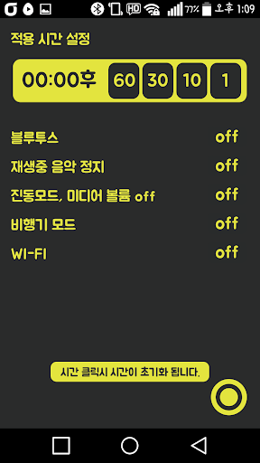
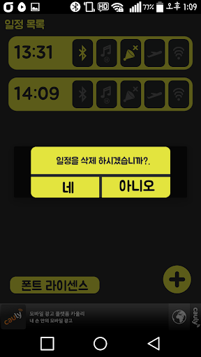
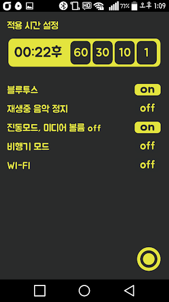

# multi-auto-timer

`updated` : 2016년 6월 9일  
`status` : [product](https://play.google.com/store/apps/details?id=com.hanstudio.timer.multiautotimer)

만능 타이머 - 시간설정 음악 끄기   

~~~
음악들으며 자다가 노래를 끄기 싫을때   
1시간만 인터넷 하자 하다가 3~4시간 할때   
등등....   

만능 타이머로 시간을 설정해 주세요.   

자기전 30분... 자동으로 음악이 꺼지고   
1시간... 자동으로 와이파이가 끊기고..   

_________________________________
   
ex) 블루투스 on 지정 시간에 블루투스 켜짐   
    블루투스 off 지정 시간에 블루투스 꺼짐

~~~   

   
   
